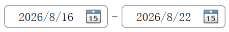

# ZeroDateRangePicker

日期范围选择用户控件，组合两个ZeroDatePicker控件，做范围选择使用。

## 属性

| 属性名       | 参数         | 说明                             |
| ------------ | ------------ | -------------------------------- |
| CornerRadius | CornerRadius | 用于设置日期控件外边框的圆角属性 |
| StartTime    | DateTime?    | 开始时间                        |
| EndTime      | DateTime?    | 结束时间                         |

配合ZeroViewModel的QueryStartTime及QueryEndTime使用，可快捷进行检索条件设置。
